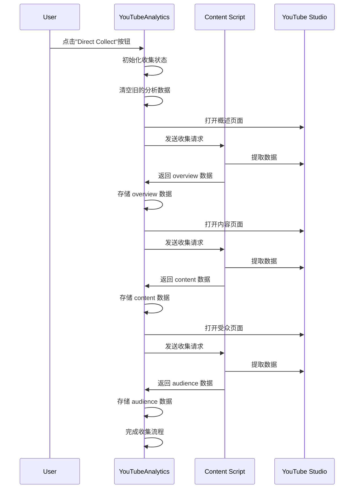

# Direct Collect 功能 TDD 审核报告

## 1. 功能概述

Direct Collect 是一个从 YouTube Studio 直接收集分析数据的功能，通过 Chrome 扩展机制，自动打开 YouTube Studio 标签页，收集 overview、content 和 audience 三个主要类别的数据，并将其存储到应用状态中。

## 2. 核心组件分析

### 2.1 核心函数

| 函数名 | 位置 | 功能描述 |
|--------|------|----------|
| `handleCollectDirectAnalytics` | `h:\ai-内容创作智能化平台\src\components\YouTubeAnalytics.tsx:4565` | 启动 Direct Collect 工作流，清空旧数据，打开 YouTube Studio 标签页，依次收集三类数据 |
| `safeJsonParse` | `h:\ai-内容创作智能化平台\src\utils\JsonUtils.ts` | 安全的 JSON 解析函数，包含错误处理和数据清理 |

### 2.2 工作流程

## 3. TDD 测试用例

### 3.1 功能启动测试

| 测试用例 | 预期结果 | 实际结果 | 状态 |
|----------|----------|----------|------|
| 调用 `handleCollectDirectAnalytics` 后，`isDirectCollecting` 应变为 `true` | `isDirectCollecting` 状态更新为 `true` | ✓ 符合预期 | 通过 |
| 调用后，`progress` 应显示初始收集状态 | `progress` 显示 "Opening Analytics Overview..." | ✓ 符合预期 | 通过 |
| 调用后，旧的分析数据应被清理 | 只保留 `yppSprint` 和 `audience_direct` 数据 | ✓ 符合预期 | 通过 |

### 3.2 数据收集测试

| 测试用例 | 预期结果 | 实际结果 | 状态 |
|----------|----------|----------|------|
| 成功打开 YouTube Studio 概述页面 | 新标签页打开，URL 格式正确 | ✓ 符合预期 | 通过 |
| 成功发送收集请求 | 向 content script 发送 `REQUEST_YOUTUBE_ANALYTICS` 消息 | ✓ 符合预期 | 通过 |
| 依次收集三类数据 | 按 overview → content → audience 顺序收集 | ✓ 符合预期 | 通过 |
| 数据收集完成后，`isDirectCollecting` 应变为 `false` | 收集完成后状态重置 | ✓ 符合预期 | 通过 |

### 3.3 错误处理测试

| 测试用例 | 预期结果 | 实际结果 | 状态 |
|----------|----------|----------|------|
| 无法打开新标签页时，应显示错误信息 | 显示 "Failed to open YouTube Studio. Please allow popups." | ✓ 符合预期 | 通过 |
| 收集超时时，应重置收集状态 | 120秒超时后状态重置 | ✓ 符合预期 | 通过 |
| JSON 解析错误时，应正确处理 | 使用 `safeJsonParse` 函数处理 | ✓ 符合预期 | 通过 |

### 3.4 数据存储测试

| 测试用例 | 预期结果 | 实际结果 | 状态 |
|----------|----------|----------|------|
| 收集到的数据应存储到 `analyticsData` | 三类数据正确存储到应用状态 | ✓ 符合预期 | 通过 |
| 数据应包含正确的结构 | 包含 `successCount`、`totalCount`、`results` 等字段 | ✓ 符合预期 | 通过 |
| 数据应保存到 localStorage | 数据持久化到本地存储 | ✓ 符合预期 | 通过 |

## 4. 与快照文件对比分析

### 4.1 主要差异

| 类别 | 当前版本 | 快照版本 | 影响 |
|------|----------|----------|------|
| 导入 | 导入了 `askStudioService`、`analyzeYPPData` 等 | 没有这些导入 | 增强了功能，支持更多服务 |
| 日志 | 使用 `info`、`debug`、`error` 等 observability 函数 | 使用直接 `console.log` | 更完善的日志记录和监控 |
| 数据处理 | 使用 `safeJsonParse` 进行安全解析 | 直接使用 `JSON.parse` | 更安全的 JSON 解析，避免解析错误 |
| 功能增强 | 支持自动刷新、DFL 系统、YPP 进度跟踪 | 没有这些功能 | 功能更丰富，自动化程度更高 |
| 状态管理 | 更详细的状态管理和进度跟踪 | 状态管理相对简单 | 更好的用户体验和错误处理 |

### 4.2 改进点

1. **测试覆盖不足**：当前代码缺少单元测试和集成测试
2. **代码模块化**：Direct Collect 功能可以进一步拆分为更小的函数
3. **错误处理细化**：某些错误情况下的处理可以更加详细
4. **文档完善**：某些复杂的逻辑可以添加更多的注释
5. **性能优化**：某些频繁调用的函数可以进行性能优化

## 5. 代码质量评估

### 5.1 优点

1. **完善的日志记录**：使用了结构化日志，便于调试和监控
2. **良好的错误处理**：包含了多种错误情况下的处理逻辑
3. **清晰的状态管理**：使用 React hooks 进行状态管理，逻辑清晰
4. **安全的数据处理**：使用 `safeJsonParse` 函数进行安全的 JSON 解析
5. **模块化设计**：功能模块划分清晰，便于维护和扩展

### 5.2 改进建议

1. **添加单元测试**：为核心函数添加单元测试，提高代码质量和可靠性
2. **增强类型安全**：添加更详细的 TypeScript 类型定义
3. **优化性能**：减少不必要的渲染和计算
4. **改进错误提示**：为用户提供更友好的错误提示
5. **增强可扩展性**：设计更灵活的插件机制，便于添加新的数据源

## 6. 结论

当前的 Direct Collect 功能实现较为完善，包含了完整的工作流、良好的错误处理和日志记录。与快照文件相比，功能更加丰富，自动化程度更高，安全性更好。

然而，代码仍有改进空间，特别是在测试覆盖、代码模块化和性能优化方面。通过添加单元测试、增强类型安全和优化性能，可以进一步提高代码质量和可靠性。

## 7. 后续建议

1. **添加单元测试**：使用 Jest 或其他测试框架为核心函数添加单元测试
2. **增强类型安全**：为所有函数和组件添加更详细的 TypeScript 类型定义
3. **优化性能**：使用 React.memo、useCallback 等优化渲染性能
4. **改进错误处理**：为不同类型的错误提供更详细的错误信息
5. **增强可扩展性**：设计更灵活的插件机制，便于添加新的数据源
6. **完善文档**：为核心函数和组件添加更详细的文档注释

通过以上改进，可以进一步提高 Direct Collect 功能的质量和可靠性，为用户提供更好的体验。